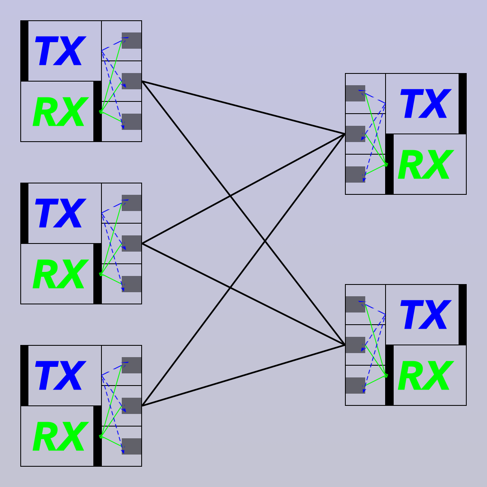

# multisocket
multisocket is an network library. Like nanomsg and zeromq, multisocket supports many transports: inproc, ipc, tcp etc. 
Unlike them, multisocket implements a message based bidirectional tx/rx independent and stateless Socket, Based on it, various protocols(reqrep, pubsub, pipline, bus etc) are built. multisocket provides sematic and easy to use interfaces to help you build complex message systems.

## Quick Start
**server**  
Socket is stateless, supports recveiving concurrently.
```golang
    sock := multisocket.NewDefault()
    if err := sock.Listen("tcp://127.0.0.1:30001"); err != nil {
        log.WithField("err", err).Panicf("listen")
    }
    
    worker := func(n int) {
        for {
            msg, err := sock.RecvMsg()
            if err != nil {
                log.WithField("err", err).Errorf("recv")
                continue
            }
            s := string(msg.Content)
            content := []byte(fmt.Sprintf("[#%d]Hello, %s", n, s))
            if err = sock.SendTo(msg.Source, content); err != nil {
                log.WithField("err", err).Errorf("send")
            }
        }
    }
    // recving concurrently
    go worker(0)
    go worker(1)
```

**client**  
tx/rx are independent
```golang
    sock := multisocket.NewDefault()
    if err := sock.Dial("tcp://127.0.0.1:30001"); err != nil {
        log.WithField("err", err).Panicf("dial")
    }
    // sending
    go func() {
        var content string
        idx := 0
        for {
            content = fmt.Sprintf("%s#%d", name, idx)
            if err = sock.Send([]byte(content)); err != nil {
                log.WithField("err", err).Errorf("send")
            }
            log.WithField("id", idx).Infof("send")
            time.Sleep(1000 * time.Millisecond)
            idx++
        }
    }()

    // recving
    go func() {
        for {
            if content, err = sock.Recv(); err != nil { 
                log.WithField("err", err).Errorf("recv")
            }
            fmt.Printf("%s\n", string(content))
        }
    }()
```

## Design
There are three layers: Protocol, Socket, Transport.


### Transport
Transport is responsible for connections between peers, common transports include: inproc, ipc, tcp, websocket etc. It's easy to implement custom transports if needed.

### Socket
Socket is based on Transport, it provides **bidrectional tx/rx independent and stateless message** communication.

### Protocol
Protocols are based on Socket, they provide various communication patterns: request/reply, publish/subscribe, push/pull etc. Also, it's easy to implement your custom protocols.

## Socket
Socket consists of thred component: Connector, Sender, Receiver.

### Connector
It's responsible for dialing/listening, to establish connections to other peers.  
connect types: 
1. N  
at most establish N connections.
2. no limit  
can establish any connections.

### Sender
It's responsible for sending messages to connected peers.  
send type:
1. to one  
fairly choose a peer to send.
2. to all  
send to all peers.
3. to dest  
send to a specified destination.
4. no send  
users can choose not to send any messages.

### Receiver
It's responsible for recving messages from peers.  
recv types:
1. no recv   
disscard any recved message from any peer. useful for protocol like: push.
2. all  
recv all messages from all peers. It's the default behaviour.

## Protocols
See wiki.

## Examples
See examples/